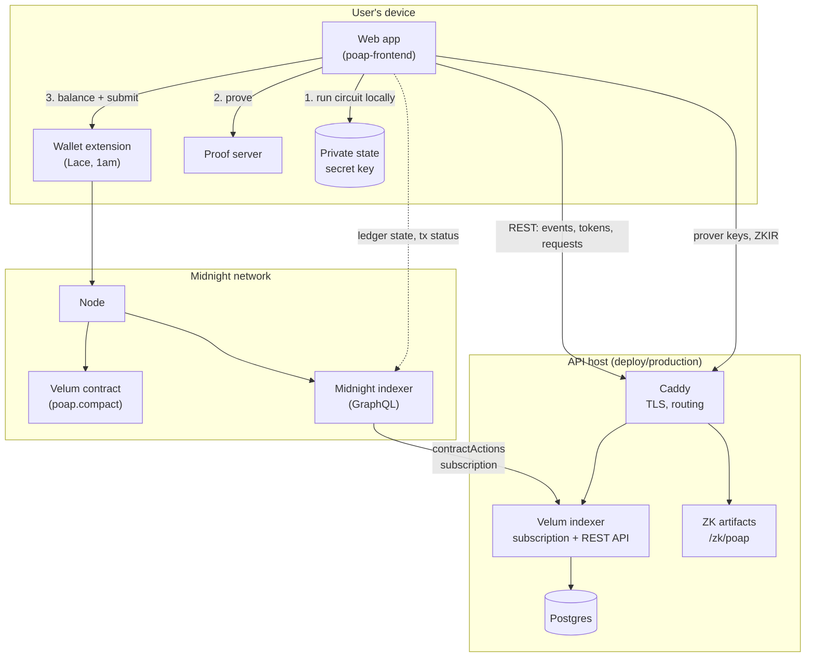

# Overview

How the pieces of Velum fit together. Start here, then go to the section for the piece you work
on.

| Document | What it covers |
|---|---|
| This page | Architecture: the components and who talks to whom |
| [End-to-end data flow](data-flow.md) | One concrete call followed from the user's click to the API response |
| [Shared data contract](data-contract.md) | Which public contract data reaches the database and the API, field by field |
| [Glossary](glossary.md) | Ledger, circuit, disclose, commitment, nullifier, finality, reorg and the rest |

## Architecture

### Components

| Component | Where it runs | Code | Role |
|---|---|---|---|
| **Contract** | Midnight (preprod) | [`contracts/compact/poap.compact`](../../contracts/compact/poap.compact) | The source of truth. Holds all public state and verifies every proof. |
| **Web app** | Vercel; runs in the user's browser | `poap-frontend` (separate repository) | Runs circuits locally, asks the proof server for proofs, hands transactions to the wallet. |
| **Wallet extension** | User's browser | Lace, 1am | Pays the DUST fee and submits transactions. Does not hold the Velum secret key. |
| **Proof server** | User's machine | `midnightntwrk/proof-server` image | Builds zero-knowledge proofs. Receives private inputs. |
| **Midnight node** | Midnight network | — | Verifies proofs and applies ledger changes. |
| **Midnight indexer** | Midnight network (public endpoint), or `devnet.yml` locally | — | Serves chain data over GraphQL. Velum's indexer and the web app both read from it. |
| **Velum indexer** | API host | [`indexer/`](../../indexer/) | One Node.js process that does two jobs: follows the contract and writes Postgres, and serves the REST API. |
| **Postgres** | API host | [`indexer/db/migrations/`](../../indexer/db/migrations/) | A queryable copy of part of the contract's public state. Rebuildable from the chain. |
| **Caddy** | API host | [`deploy/production/Caddyfile`](../../deploy/production/Caddyfile) | TLS and routing. Also serves the ZK artifacts as static files. |
| **IPFS proxy** (optional) | API host | `poap-frontend/server` (separate repository) | Metadata pinning, encrypted backups and credential delivery. Not part of this repository. |
| **Deploy scripts** | A developer machine | [`scripts/`](../../scripts/) | Deploy and upgrade the contract. |

### Three things worth knowing up front

1. **Nothing private reaches the server side.** The secret key, attribute values and Merkle paths
   stay on the user's device (and their proof server). The Velum indexer reads only the public
   ledger, so the database and the API contain public data only.
2. **The indexer and the API are the same process.** There is no separate backend service. "The
   API" in these documents means the REST routes in `indexer/src/api/`.
3. **The API is a convenience, not an authority.** It is a delayed copy of the chain. Anything
   that matters (who owns what, whether a credential is revoked) is decided by the contract, and
   proofs are checked against the chain, not against the API.

## Sections

| Section | Contents |
|---|---|
| [01-contract](../01-contract/README.md) | The Compact contract: public vs private data, circuits, security |
| [02-indexer](../02-indexer/README.md) | How the chain is followed and turned into database rows |
| [03-api](../03-api/README.md) | The REST API: endpoints, conventions, quickstart |
| [04-operations](../04-operations/README.md) | Environments, local setup, deploy order, monitoring, runbooks |
