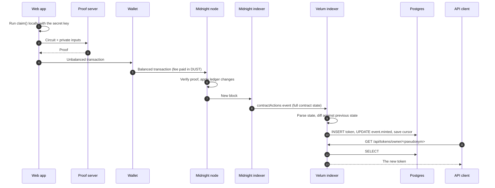

# End-to-end data flow

Two concrete cases: a call that changes state, and a proof that does not.

## Case 1: a user claims a credential

*"The user calls `claim`. When and how does it show up in the API?"*

| Step | Where | What happens | Detail |
|---|---|---|---|
| 1 | User's device | The compiled contract runs `claim` in JavaScript. The `local_sk` witness supplies the secret key; the circuit derives the holder pseudonym. If any `assert` fails, it stops here. | [Circuits](../01-contract/circuits.md#2-claim-self-service) |
| 2–3 | Proof server | A proof is built from the private inputs. | |
| 4–5 | Wallet | The wallet adds the fee, the user approves, the transaction is submitted. | |
| 6 | Chain | The node verifies the proof and applies the ledger operations: `tokenOwner`, `tokenEvent`, `tokenIssuer`, `tokenMetadataURI`, `tokenPrivateMetadataCommit`, `eventHolderToken`, `credentials`, `totalSupply`, and the event's `minted` counter. | |
| 7–8 | Midnight indexer | The block is indexed. The `contractActions` subscription emits one event carrying the contract's whole state after the call, the transaction hash, the block height and the entry point (`claim`). | [Data source](../02-indexer/README.md#data-source) |
| 9 | Velum indexer | The state is deserialized with the compiled contract's `ledger()` function and compared with the previous state. The diff shows one new `tokenOwner` entry and a changed `events` entry. | [Mapping](../02-indexer/mapping.md) |
| 10 | Postgres | In one transaction: a row is inserted in `tokens` and `events.minted` is updated. Then the cursor is saved. | [Data model](../02-indexer/data-model.md) |
| 11–13 | API | The token is now returned by `/api/tokens/:tokenId`, `/api/tokens/owner/:ownerPk` and `/api/events/:eventId/tokens`. | [Endpoints](../03-api/endpoints.md) |

**How long does it take?** The API lags the chain by the time for the transaction to be included
in a block, for the Midnight indexer to index that block, and for the Velum indexer to write the
rows. The first two dominate and are outside Velum's control. The web app does not wait on the
API for confirmation: it watches the transaction through the Midnight indexer directly.

**What the API never shows for this call:** the caller's secret key, their public key (`claim`
does not publish it), and the `isSoulbound` flag. None of them are on the ledger.

## Case 2: a holder proves attendance anonymously

*"The holder calls `proveEventAttendance`. What shows up in the API?"*

**Nothing.**

Steps 1 to 7 are the same as above: the proof is built, the transaction is submitted, the chain
verifies it. But the circuit writes nothing to the ledger. The Velum indexer receives a
`contractActions` event whose state is identical to the previous one, computes an empty diff and
writes no rows (it only advances its cursor).

To check such a proof, a verifier looks at the chain, not at the Velum API:

1. Find the transaction on the Midnight indexer.
2. Confirm it is a successful call to the Velum contract and that the entry point is
   `proveEventAttendance`.
3. Read the request id from the transaction's public transcript and confirm it is the request
   they published.

The web app's receipt checker does this. A successful transaction is the proof: every failure
path in these circuits is an `assert`, so a failed proof never lands on-chain.

The same applies to `proveTokenOwnership`, `proveCredentialAttribute` and
`proveAttributeMembership`. Only `proveAttributeMembershipOnce` leaves a trace in the database
(one row in `disclosure_nullifiers`).

## What each kind of call leaves behind

| Call | Ledger change | Database | API |
|---|---|---|---|
| `createEvent` | new `events` entry | new `events` row (and an `issuers` row if missing) | `/api/events` |
| `claim`, `mintTo` | new token entries, `minted` + 1 | new `tokens` row, `events.minted` | `/api/tokens/…`, `/api/events/…` |
| `burn` | new `burnedTokens` entry; the token's pending update request, if any, is removed | `tokens.is_burned`; `credential_update_requests.status = 'burned'` | `isBurned` on the token; `status` on the update request |
| `requestCredentialUpdate` | new or replaced `credentialUpdateRequests` entry | `credential_update_requests` row, `status = 'pending'` | `/api/credential-update-requests` |
| `dismissCredentialUpdate` | `credentialUpdateRequests` entry removed | `credential_update_requests.status = 'dismissed'` | `status` on the update request |
| `deactivateEvent` | `isActive = false` | `events.is_active`, `deactivated_block` | `isActive` on the event |
| `publishDisclosureRequest` | new `disclosureRequests` entry | new `disclosure_requests` row | `/api/disclosure-requests` |
| `registerIssuer`, `deactivateIssuer` | `issuers` entry | `issuers` row | not exposed |
| `proveAttributeMembershipOnce` | new nullifier | new `disclosure_nullifiers` row | not exposed |
| Other proofs | none | none | none |
| `pause`, `unpause`, `reveal…` | yes | **not indexed** | not exposed |

The complete field-level mapping is in the [shared data contract](data-contract.md).
