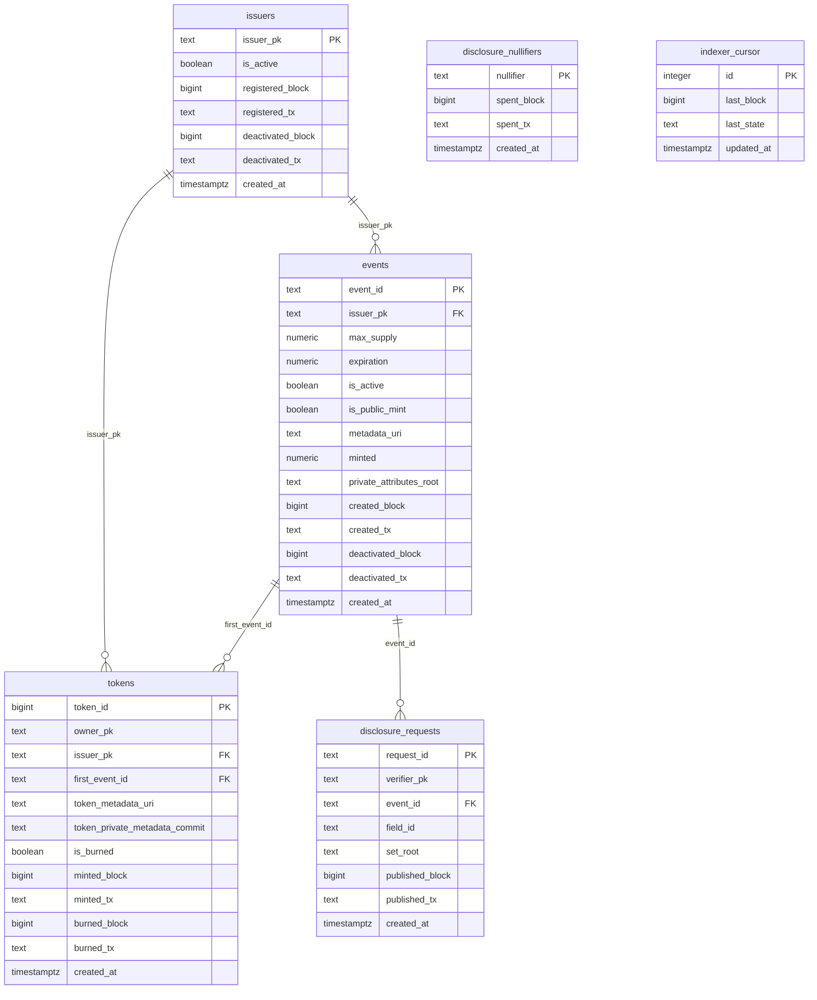

# Data model

The schema is in [`indexer/db/migrations/`](../../indexer/db/migrations/): `001_init.sql`
creates the tables and `002_uint64_columns.sql` widens three columns. Every file is applied on
every start, in name order, and is safe to run repeatedly.

Production runs Postgres 16; the local devnet runs Postgres 15.

## Diagram

`disclosure_nullifiers` and `indexer_cursor` have no relations.

In every table, `created_at` is when the **indexer** inserted the row, not when the transaction
happened on-chain. During a backfill all rows get roughly the same value. Use the `*_block`
columns for chain time.

## Tables

"Source" is the ledger field of
[`poap.compact`](../../contracts/compact/poap.compact) the column is read from. "tx" means the
column is taken from the transaction being processed.

### `issuers`

One row per organizer public key that was registered, blocked, or created an event.

| Column | Type | Meaning | Source |
|---|---|---|---|
| `issuer_pk` | `TEXT` PK | Organizer public key, hex | key of `issuers`, or `events[…].organizer` |
| `is_active` | `BOOLEAN` | Not blocked. `TRUE` alone does not mean "verified"; see [open gaps](mapping.md#open). | `issuers[pk].isActive` |
| `registered_block`, `registered_tx` | `BIGINT`, `TEXT` | The `registerIssuer` transaction. `NULL` for organizers that were never registered. | tx |
| `deactivated_block`, `deactivated_tx` | `BIGINT`, `TEXT` | Transaction that blocked it | tx |
| `created_at` | `TIMESTAMPTZ` | Row insertion time | — |

### `events`

| Column | Type | Meaning | Source |
|---|---|---|---|
| `event_id` | `TEXT` PK | Event id, hex | key of `events` |
| `issuer_pk` | `TEXT` FK → `issuers` | Organizer | `events[id].organizer` |
| `max_supply` | `NUMERIC(20,0)` | Mint cap, `0` = unlimited. Full `Uint<64>` range. | `events[id].maxSupply` |
| `expiration` | `NUMERIC(20,0)` | Block time after which minting stops, `0` = never. Full `Uint<64>` range. | `events[id].expiration` |
| `is_active` | `BOOLEAN` | Minting enabled | `events[id].isActive` |
| `is_public_mint` | `BOOLEAN` | Self-service `claim` allowed | `events[id].isPublicMint` |
| `metadata_uri` | `TEXT` | Off-chain metadata URI | `events[id].metadataURI` |
| `minted` | `NUMERIC(20,0)` | Tokens minted so far, including burned ones | `events[id].minted` |
| `private_attributes_root` | `TEXT` | Root of the hidden attribute tree, hex. All zeros = none. | `events[id].privateAttributesRoot` |
| `created_block`, `created_tx` | `BIGINT`, `TEXT` | Creating transaction | tx |
| `deactivated_block`, `deactivated_tx` | `BIGINT`, `TEXT` | Deactivating transaction. Cleared if the event is reactivated. | tx |
| `created_at` | `TIMESTAMPTZ` | Row insertion time | — |

### `tokens`

| Column | Type | Meaning | Source |
|---|---|---|---|
| `token_id` | `BIGINT` PK | Sequential token id | key of `tokenOwner` |
| `owner_pk` | `TEXT` | Holder pseudonym, hex | `tokenOwner[id]` |
| `issuer_pk` | `TEXT` FK → `issuers` | Issuer | `tokenIssuer[id]` |
| `first_event_id` | `TEXT` FK → `events` | The token's event (historical name) | `tokenEvent[id]` |
| `token_metadata_uri` | `TEXT` | This token's metadata URI | `tokenMetadataURI[id]` |
| `token_private_metadata_commit` | `TEXT` | Commitment to hidden per-token metadata, hex. All zeros = none. | `tokenPrivateMetadataCommit[id]` |
| `is_burned` | `BOOLEAN` | Burned or revoked | presence in `burnedTokens` |
| `minted_block`, `minted_tx` | `BIGINT`, `TEXT` | Minting transaction | tx |
| `burned_block`, `burned_tx` | `BIGINT`, `TEXT` | Burning transaction | tx |
| `created_at` | `TIMESTAMPTZ` | Row insertion time | — |

### `disclosure_requests`

Immutable once inserted.

| Column | Type | Meaning | Source |
|---|---|---|---|
| `request_id` | `TEXT` PK | Request id, hex | key of `disclosureRequests` |
| `verifier_pk` | `TEXT` | Publisher's public key | `disclosureRequests[id].verifier` |
| `event_id` | `TEXT` FK → `events` | Event asked about | `.eventId` |
| `field_id` | `TEXT` | Attribute asked about. All zeros = ownership-only. | `.fieldId` |
| `set_root` | `TEXT` | Merkle root of accepted values. All zeros = ownership-only. | `.setRoot` |
| `published_block`, `published_tx` | `BIGINT`, `TEXT` | Publishing transaction | tx |
| `created_at` | `TIMESTAMPTZ` | Row insertion time | — |

### `disclosure_nullifiers`

One row per successful `proveAttributeMembershipOnce`. There are deliberately no event, field or
holder columns: the contract does not disclose them.

| Column | Type | Meaning | Source |
|---|---|---|---|
| `nullifier` | `TEXT` PK | Nullifier, hex | element of `usedDisclosures` |
| `spent_block`, `spent_tx` | `BIGINT`, `TEXT` | Transaction that spent it | tx |
| `created_at` | `TIMESTAMPTZ` | Row insertion time | — |

### `indexer_cursor`

The checkpoint. Always exactly one row, `id = 1`.

| Column | Type | Meaning |
|---|---|---|
| `id` | `INTEGER` PK | Always `1` |
| `last_block` | `BIGINT` | Height of the block containing the last processed contract action. `0` before anything was processed. |
| `last_state` | `TEXT` | The contract's full state after that action, hex. Used to rebuild the "previous state" for diffing after a restart. Grows with the contract's state. |
| `updated_at` | `TIMESTAMPTZ` | When the cursor was last saved |

`last_block` is **not** "the latest block the indexer has seen". It only moves when the contract
has an action. See [Operation](operations.md#measuring-lag) before using it for a lag metric.

## Indexes

| Index | On | Serves |
|---|---|---|
| primary keys | each table's id | single-row lookups |
| `tokens_owner_pk_idx` | `tokens(owner_pk)` | `GET /api/tokens/owner/:ownerPk` |
| `tokens_issuer_pk_idx` | `tokens(issuer_pk)` | not used by a current endpoint |
| `tokens_first_event_id_idx` | `tokens(first_event_id)` | `GET /api/events/:eventId/tokens`, `liveTokens` |
| `events_issuer_pk_idx` | `events(issuer_pk)` | `GET /api/events?issuerPk=` |
| `disclosure_requests_verifier_pk_idx` | `disclosure_requests(verifier_pk)` | `GET /api/disclosure-requests?verifierPk=` |
| `disclosure_requests_event_id_idx` | `disclosure_requests(event_id)` | not used by a current endpoint |

## Migrations

There is no migration tracking table. Every `.sql` file in `db/migrations/` is run in name
order at each start, so each file must be safe to run repeatedly. To add a column, append an
`ALTER TABLE … ADD COLUMN IF NOT EXISTS` to a new numbered file, and remember that existing rows
will hold the default until a reindex.
