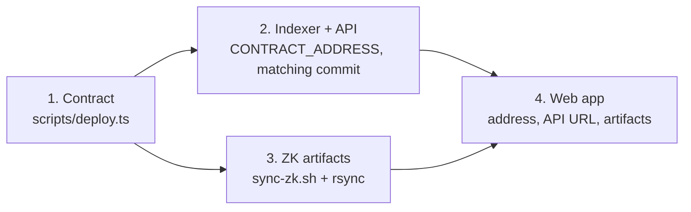

# Deploying

The order in which the pieces go out, for a first deployment, for a contract upgrade and for a
replacement contract. Server preparation (Ubuntu, Docker, DNS, firewall, TLS) is in
[`deploy/production/README.md`](../../deploy/production/README.md).

## The order, and why



| Step | Depends on | Why |
|---|---|---|
| 1. Contract | — | It produces the address everything else is configured with. |
| 2. Indexer and API | The address, and the commit the contract was compiled from | The indexer parses state with the compiled contract baked into its image. |
| 3. ZK artifacts | The exact build that was deployed | Clients prove with these keys; they must match the verifier keys on-chain. |
| 4. Web app | The address, the API, the artifacts | It is the only piece users touch; it goes last so it never points at something missing. |

**The indexer needs no start block.** On an empty database it replays the contract's history
from its deployment. Just give it the address.

The indexer and the API are one process and one container, so "deploy the indexer, then the API"
is a single step.

## First deployment

### 1. Contract (from a developer machine)

```bash
npm install
npm run compact --workspace contracts
npm run compact:shell --workspace contracts
docker compose -f devnet.yml up -d proof-server

MN_TEST_ENVIRONMENT=preprod MN_TEST_WALLET_SEED=<hex seed of a funded wallet> SKIP_DEMO_EVENT=1 \
  npx tsx scripts/deploy.ts
```

- Get a wallet and the address to fund with
  `MN_TEST_ENVIRONMENT=preprod npx tsx scripts/wallet-info.ts`.
- The first run on preprod waits for the wallet to replay the network's DUST history, which
  took 1.5–2 hours. Progress is saved in `.wallet-state/` and reused.
- The deployment is staged: a circuit-less shell, then one transaction per verifier key (20
  today, about 25 seconds each on preprod).
- `SKIP_DEMO_EVENT=1` leaves the contract empty. Without it the script also creates a demo
  event, which has no image and is only useful on a local devnet.
- `deploy.ts` overwrites `deployments/preprod.md` and `.env.preprod.local`. Back the env file up
  first if it holds anything else, and merge the earlier deployments back into the record.
- If it is interrupted after the shell is deployed, do not simply run `deploy.ts` again: it
  always starts by deploying a new shell. To finish staging on the address that already exists,
  run `CONTRACT_ADDRESS=<addr> npx tsx scripts/upgrade.ts --apply`, which inserts the circuits
  that are missing. The demo event and the deployment record then have to be created by hand.
- Output: `deployments/preprod.md` and `.env.preprod.local`. **Commit the deployment record.
  Keep the env file and the seed private.**

Record the commit the contract was compiled from. Everything else is built from that commit.

### 2. Indexer and API (on the API host)

```bash
cd /opt/velum/poap-midnight && git checkout <the commit from step 1>
cd deploy/production
cp .env.example .env && chmod 600 .env     # CONTRACT_ADDRESS, network, endpoints, CORS, DB password
docker compose up -d --build
docker compose logs -f indexer             # expect: applied 001…004 .sql, [gql-ws] connected
```

### 3. ZK artifacts

On the machine that has the keys:

```bash
./deploy/production/sync-zk.sh
rsync -az --delete deploy/production/zk/ <user>@<host>:/opt/velum/poap-midnight/deploy/production/zk/
```

On the host:

```bash
cd /opt/velum/poap-midnight/deploy/production/zk/poap && sha256sum -c --quiet SHA256SUMS && echo OK
```

### 4. Web app

Set the contract address, the network id and the API URL in the web app's environment, give it
the matching compiled contract, and deploy it. Its variables are listed in
[`deploy/production/README.md`](../../deploy/production/README.md#frontend-on-vercel).

### 5. Verify

```bash
curl -s  https://$API_DOMAIN/health
curl -s  https://$API_DOMAIN/api/events                              # the demo event, or [] if deployed empty
curl -s  https://$API_DOMAIN/api/credential-update-requests          # 200: the image has the current API
curl -sI https://$API_DOMAIN/zk/poap/keys/claim.verifier | head -1   # HTTP/2 200
```

Then make one real transaction through the web app, for example a claim, and confirm it shows
up in the API.

## Contract upgrade (same address)

Use when circuit logic changes and the `ledger` declarations and circuit signatures do not. A
quick test: `contracts/src/managed/poap/contract/index.d.ts` has no diff. Comment-only changes
need no upgrade at all.

| Step | Where | Action |
|---|---|---|
| 1 | Developer machine | `npm run compact --workspace contracts` (full build) |
| 2 | Developer machine | `CONTRACT_ADDRESS=<addr> npx tsx scripts/upgrade.ts` prints which circuits differ. No wallet needed. |
| 3 | Developer machine | Add `--apply` with the deployer's seed. Each changed circuit's key is removed and re-inserted. |
| 4 | API host | `sync-zk.sh` + `rsync` the new artifacts |
| 5 | Web app | Deploy with the new compiled contract |
| 6 | API host | `git pull && docker compose up -d --build` |
| 7 | Repository | Add the upgrade to `deployments/<network>.md` and to the [contract changelog](../01-contract/changelog.md) |

- **Do steps 4 and 5 immediately after step 3.** Between a circuit's key being replaced and
  clients getting the new build, calls to that circuit fail.
- No database reset and no `CONTRACT_ADDRESS` change.
- An interrupted `--apply` is safe to run again.

## New deployment (new address)

Required when the ledger layout or a circuit signature changes. Existing credentials stay on the
old contract; nothing migrates them.

| Step | Action |
|---|---|
| 1 | Deploy with `scripts/deploy.ts` (see [First deployment](#first-deployment)) |
| 2 | API host: `git pull` to the matching commit, set the new `CONTRACT_ADDRESS` in `.env` |
| 3 | ZK artifacts: `sync-zk.sh` + `rsync`, then compare the host's `/zk/poap/SHA256SUMS` with the local one |
| 4 | **Reset the indexer database.** Its rows and cursor belong to the old contract: `docker compose down && docker volume rm velum_pgdata && docker compose up -d --build` |
| 5 | Web app: new address, new compiled contract, redeploy |
| 6 | Update `deployments/<network>.md` and the changelog |

## Changes that do not touch the contract

| Change | Procedure |
|---|---|
| Indexer or API code | `git pull && docker compose up -d --build` on the host. The indexer resumes from its cursor. |
| A new indexed field or a handler fix | Same, then [reindex](../02-indexer/sync.md#reindexing-from-scratch) so old rows are corrected |
| Caddy configuration | `docker compose up -d` (the Caddyfile is mounted) |
| CORS origins | Edit `.env`, `docker compose up -d` |

## Rollback

| Piece | How |
|---|---|
| Indexer / API | Check out the previous commit and rebuild. The database is compatible unless a migration was added. |
| ZK artifacts | `rsync` the previous set. They must match what is on-chain. |
| Web app | Redeploy the previous build |
| Contract upgrade | Check out the previous contract source, rebuild, and run `upgrade.ts --apply` again. It swaps the keys back. |
| New deployment | Point everything back at the old address. The old contract is still there. |
